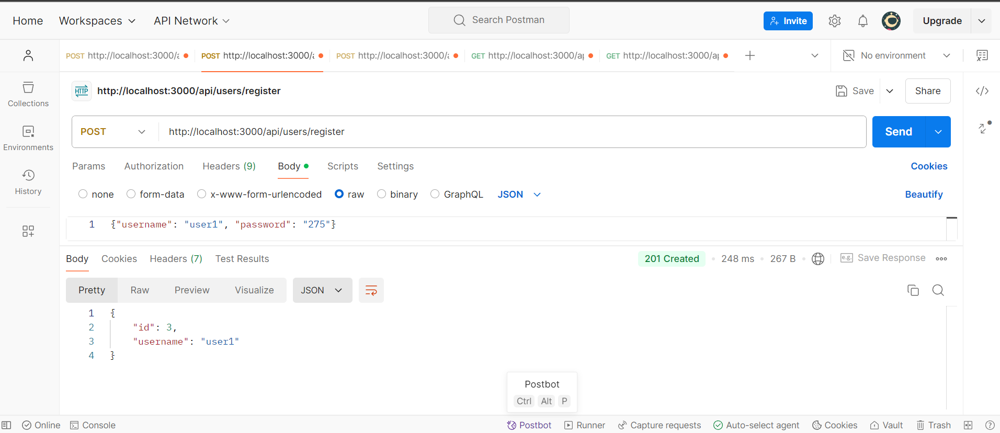
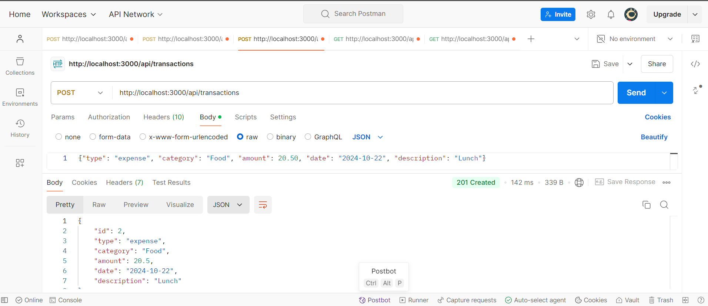
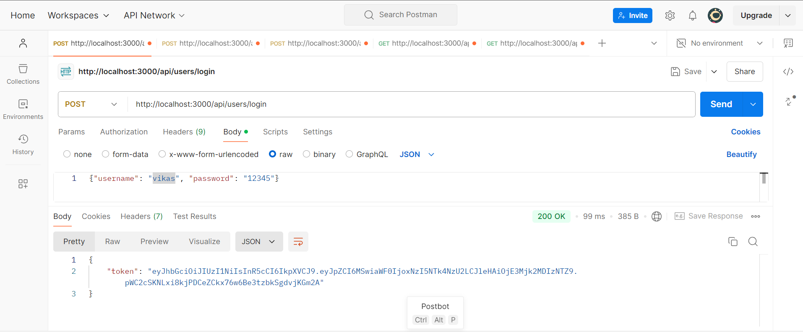
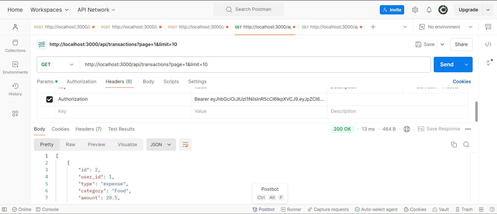
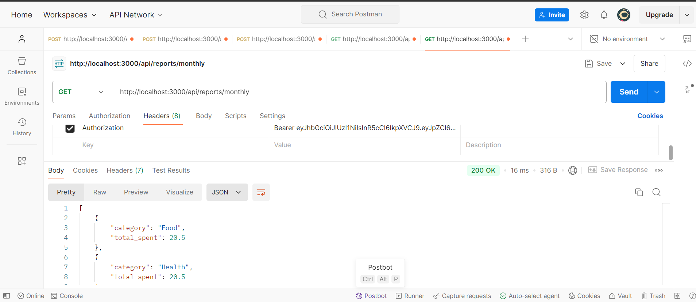
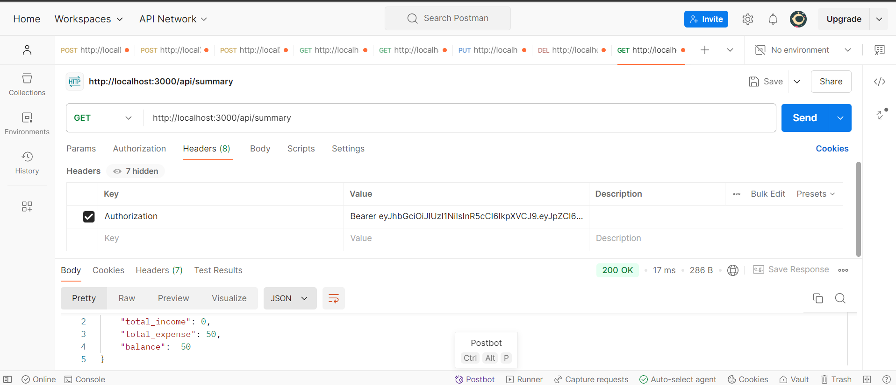
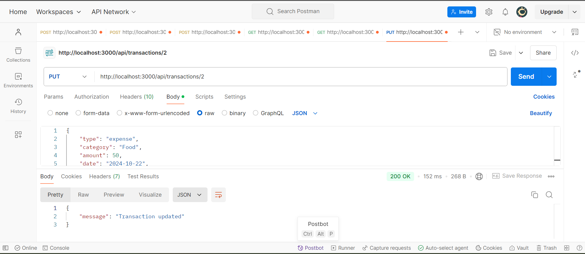
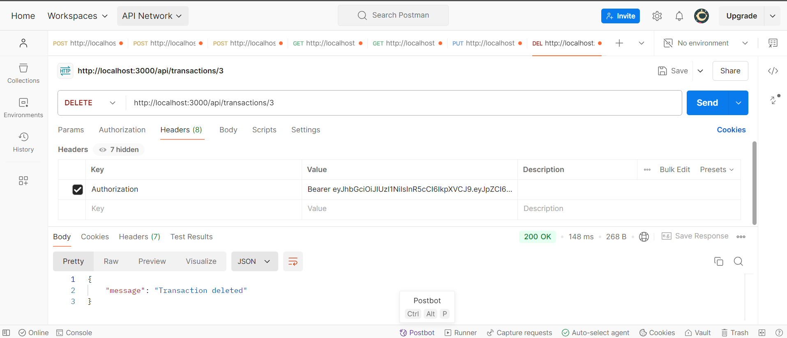

# Expense-Tracker API

This API allows users to manage their transactions. It includes functionality to add, retrieve, update, delete, and report on transactions.

## Table of Contents
1. [Setup](#setup)
2. [Running the Server](#running-the-server)
3. [API Endpoints](#api-endpoints)
   - [POST /transactions](#post-transactions)
   - [GET /transactions](#get-transactions)
   - [GET /transactions/:id](#get-transactionsid)
   - [PUT /transactions/:id](#put-transactionsid)
   - [DELETE /transactions/:id](#delete-transactionsid)
   - [GET /summary](#get-summary)
   - [GET /reports/monthly](#get-reportsmonthly)
4. [Postman Collection](#postman-collection)

---

## Setup

### Prerequisites

- [Node.js](https://nodejs.org/) installed (version 14 or higher recommended)
- [SQLite3](https://www.sqlite.org/index.html) or another supported database
- Postman (for testing APIs)

### Steps

1. Clone the repository:

   ```bash
   git clone https://github.com/your-username/your-repo.git
   cd your-repo
   ```

2. Install dependencies:

   ```bash
   npm install
   ```


3. Start the server:

   ```bash
   npm start
   ```

---

## Running the Server

1. To start the server:

   ```bash
   npm start
   ```

2. The server will run by default on `http://localhost:3000`.

---

## API Endpoints

### Authentication
All endpoints require JWT authentication. Pass the `Authorization` header in the format:

```
Authorization: Bearer <token>
```

### POST /transactions
- **Description**: Add a new transaction.
- **URL**: `/transactions`
- **Method**: `POST`
- **Body Parameters**:
  - `type` (string) - Type of transaction (`income` or `expense`)
  - `category` (string) - Category of the transaction
  - `amount` (number) - Amount of the transaction
  - `date` (string) - Date of the transaction (in ISO format)
  - `description` (string) - Optional description

#### Example Request:

```json
{
  "type": "expense",
  "category": "groceries",
  "amount": 50.75,
  "date": "2024-10-21",
  "description": "Weekly grocery shopping"
}
```

#### Example Response:
```json
{
  "id": 1,
  "type": "expense",
  "category": "groceries",
  "amount": 50.75,
  "date": "2024-10-21",
  "description": "Weekly grocery shopping"
}
```

---

### GET /transactions
- **Description**: Retrieve all transactions with pagination.
- **URL**: `/transactions`
- **Method**: `GET`
- **Query Parameters**:
  - `page` (number) - Page number (default is 1)
  - `limit` (number) - Number of results per page (default is 10)

#### Example Request:
```bash
GET /transactions?page=1&limit=10
```

#### Example Response:
```json
[
  {
    "id": 1,
    "type": "expense",
    "category": "groceries",
    "amount": 50.75,
    "date": "2024-10-21",
    "description": "Weekly grocery shopping"
  },
  ...
]
```

---

### GET /transactions/:id
- **Description**: Retrieve a transaction by ID.
- **URL**: `/transactions/:id`
- **Method**: `GET`

#### Example Request:
```bash
GET /transactions/1
```

#### Example Response:
```json
{
  "id": 1,
  "type": "expense",
  "category": "groceries",
  "amount": 50.75,
  "date": "2024-10-21",
  "description": "Weekly grocery shopping"
}
```

---

### PUT /transactions/:id
- **Description**: Update a transaction by ID.
- **URL**: `/transactions/:id`
- **Method**: `PUT`
- **Body Parameters**:
  - `type` (string)
  - `category` (string)
  - `amount` (number)
  - `date` (string)
  - `description` (string, optional)

#### Example Request:
```json
{
  "type": "expense",
  "category": "utilities",
  "amount": 100,
  "date": "2024-10-22",
  "description": "Electricity bill"
}
```

#### Example Response:
```json
{
  "message": "Transaction updated"
}
```

---

### DELETE /transactions/:id
- **Description**: Delete a transaction by ID.
- **URL**: `/transactions/:id`
- **Method**: `DELETE`

#### Example Request:
```bash
DELETE /transactions/1
```

#### Example Response:
```json
{
  "message": "Transaction deleted"
}
```

---

### GET /summary
- **Description**: Get a summary of transactions (total income, total expense, and balance).
- **URL**: `/summary`
- **Method**: `GET`

#### Example Response:
```json
{
  "total_income": 5000,
  "total_expense": 2500,
  "balance": 2500
}
```

---

### GET /reports/monthly
- **Description**: Get a monthly spending report grouped by category.
- **URL**: `/reports/monthly`
- **Method**: `GET`

#### Example Response:
```json
[
  {
    "category": "groceries",
    "total_spent": 200
  },
  {
    "category": "utilities",
    "total_spent": 150
  }
]
```

---


### Postman Screenshots

### POST /transactions
## Register a user

## Add a transaction to a user

## Login a user


### GET /transactions
## Getting all the transactions

## Getting Monthly Report

## Getting Summary



### PUT /transactions/:id


### DELETE /transactions/:id


---

